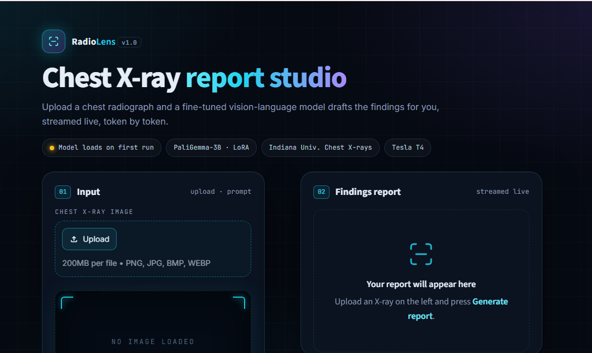
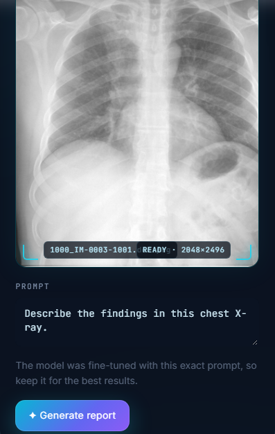
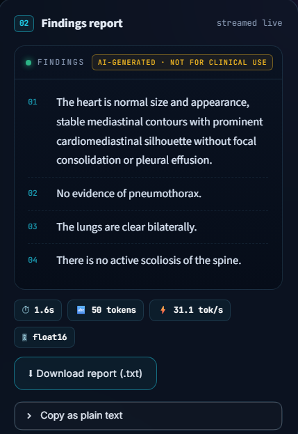

# Chest X-Ray Report Generation — Fine-Tuned Vision-Language Model

A LoRA fine-tuned PaliGemma-3B model that generates radiology-style findings text from chest X-ray images, trained on the IU-Xray (Indiana University Chest X-rays) dataset.

**⚠️ This is a research/educational project, not a diagnostic tool.** See [Limitations](#limitations) below — the model has known, honestly-evaluated weaknesses.

## Demo





Run locally:
```bash
pip install -r requirements.txt
streamlit run app.py
```
Requires a HuggingFace token with access to `google/paligemma-3b-pt-224` (a gated model). You'll need your own — never commit tokens directly into code.

**Getting a token:**
1. Create a free account at [huggingface.co](https://huggingface.co) if you don't have one.
2. Visit the [PaliGemma model page](https://huggingface.co/google/paligemma-3b-pt-224) and accept the license terms (required once, since it's gated).
3. Go to Settings → Access Tokens → create a new token (read access is enough).
4. Set it as an environment variable before running the app:
   ```bash
   export HF_TOKEN="your_token_here"       # macOS/Linux
   set HF_TOKEN=your_token_here            # Windows (cmd)
   ```
   Or, if deploying to Streamlit Community Cloud, add it under your app's Settings → Secrets as `HF_TOKEN = "your_token_here"`.

**Note:** this app requires a GPU to run at a reasonable speed (a 3B-parameter model on CPU will be very slow). It was developed and tested on a Kaggle T4 GPU — running it locally without a GPU is possible but not recommended.

## How it works

1. A chest X-ray is chopped into patches and encoded by PaliGemma's vision tower (a CLIP-style Vision Transformer) into a sequence of patch embeddings.
2. A projection layer maps these into the same embedding space as text tokens.
3. The merged image + text token sequence passes through PaliGemma's language model, which generates findings text one token at a time.
4. Only a small set of LoRA adapter matrices (attached to the attention projections, `q_proj`/`k_proj`/`v_proj`/`o_proj`, in both the vision tower and language model) were fine-tuned — the base model's ~2.9B parameters stayed frozen. This is what makes fine-tuning feasible on a single free-tier Kaggle T4 GPU.

## Dataset

- **IU-Xray**: ~3,850 patients, ~7,000+ images with paired radiology reports (via Kaggle).
- Merged on patient ID; the `findings` field was used as the training target (not `impression`), since it's the only text field that describes what's actually visible in the image rather than context like patient history.
- Train/validation/test splits were made by patient ID, not by image, to prevent a patient's frontal and lateral views from leaking across splits.
- `XXXX` de-identification placeholders (dates/ages redacted for privacy) were stripped during text cleaning.

## Training

- Base model: `google/paligemma-3b-pt-224`
- Method: LoRA (r=8, alpha=16), targeting attention projections
- 3 epochs, effective batch size 8, fp16, single T4 GPU
- Best checkpoint selected by validation loss (epoch 3)

| Epoch | Training Loss | Validation Loss |
|---|---|---|
| 1 | 1.459 | 1.244 |
| 2 | 1.128 | 1.142 |
| 3 | 1.163 | **1.105** |

Validation loss plateaued and began overfitting past epoch 3 in later runs — see [Experiments](#experiments-tried) below.

## Evaluation

Computed on a held-out test set (patients never seen during training), using sampled generation (temperature=0.7-0.8, top_p=0.9):

| Metric | Score |
|---|---|
| ROUGE-1 | 0.379 |
| ROUGE-2 | 0.135 |
| ROUGE-L | 0.270 |
| BERTScore F1 (overall) | 0.854 |
| BERTScore F1 (abnormal cases only, by MeSH label) | 0.849 |

The model performs comparably on abnormal/pathology cases as on normal ones by this metric — though see the limitations below on what this metric can and can't tell you.

## Experiments tried

- **Higher LoRA rank (r=16, alpha=32)**: achieved a marginally better validation loss (1.081 vs. 1.105) but *worse* ROUGE/BERTScore on the test set, and overfit noticeably by epoch 5 (validation loss rose from 1.081 to 1.231 across epochs 3-5). This is a useful negative result: lower validation loss didn't translate to better generation quality, likely due to sampling variance and the added capacity overfitting on a relatively small dataset (~4,500 training reports).
- **Loss-weighted training** (upweighting non-boilerplate/abnormal reports to address a measured 39-42% "normal-phrasing" skew in the training data): did not outperform the unweighted baseline on any held-out metric, including on the abnormal subset specifically. Suggests class imbalance, while real, was not the dominant limiting factor at this model/data scale.
- Both experiments are documented rather than hidden, since a clearly diagnosed negative result is more useful (and more honest) than pretending every change helped.

## Limitations

- **General-domain evaluation metric.** BERTScore here uses a general-English embedding model, not a clinical-domain one, so semantic similarity scores may not fully capture fine-grained clinical correctness.
- **2D-only, single dataset, single institution.** No external validation on other X-ray datasets or imaging equipment.
- **Not clinically validated.** Never intended for, and should never be used for, real diagnostic purposes.

## Future work

- Class-balanced/weighted training with a stronger regularization scheme (the naive weighting attempt here didn't help — worth revisiting with dropout tuning or a different reweighting strategy)
- Clinical-domain evaluation (e.g., Bio_ClinicalBERT-based BERTScore, or CheXbert/RadGraph-style clinical accuracy metrics)
- Higher input resolution (PaliGemma's 448/896 variants) to better capture subtle findings
- Multi-institution data for better generalization

## Tech stack

Python, PyTorch, HuggingFace Transformers, PEFT (LoRA), Streamlit, `evaluate` (ROUGE/BERTScore)
